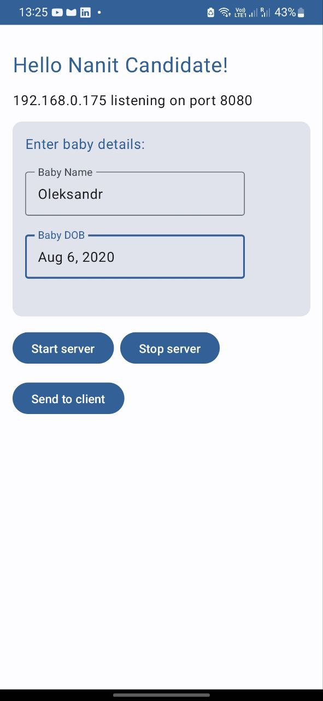
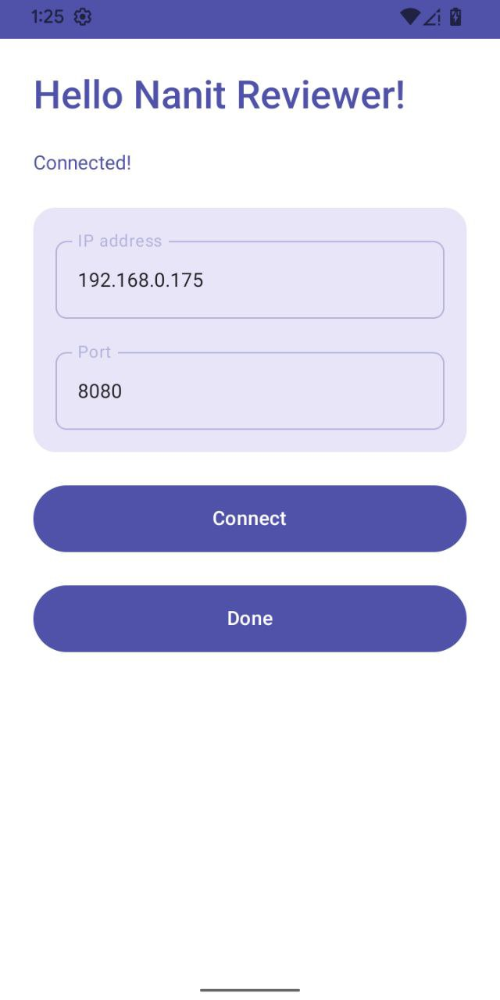
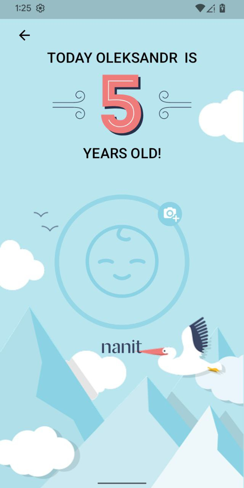
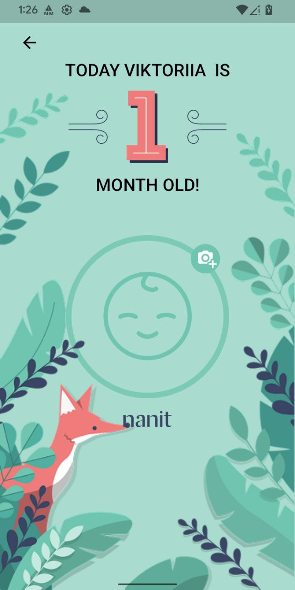
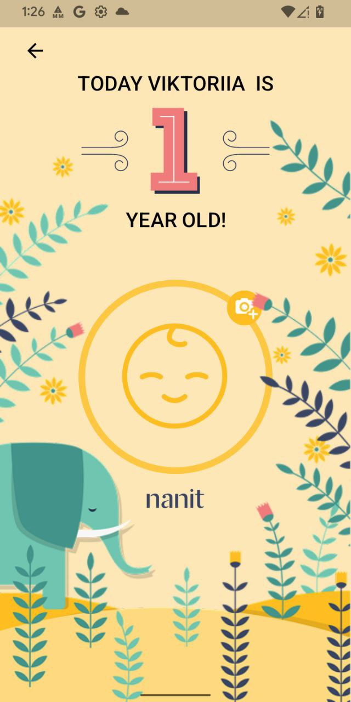

# 🎂 Birthday App Test Assigment

# **Specifications**

1. The client app you will write needs to communicate with the server app in order to receive the information for the screen.  
2. The server app will show you the needed IP in order to connect, if the app will be unable to find it, you will need to look for the IP of the phone running the server app yourself.  
3. Communication will be done with a websocket implementation. Feel free to use any socket libraries.   
   1. Common options for Android include **OkHttp** and **Ktor**.  
4. Communication protocol will be described below.  
5. The part of communicating with the server, its initiation and UI are up to you. You can choose to skip a UI for that part altogether, if you do, mention where the IP should be entered.   
6. No matter what you decide in (5) make sure the UI never feels stuck and without any loading.  
7. When the information is received on the websocket, users will be able to see the birthday screen. Birthday screen should follow the design and use the attached UI assets. **For this screen the design is important**. **Pay attention to details and stick to original design**.   
   1. Font types can be ignored:  
   2. The birthday screen has 3 visual options. The theme will be randomly chosen and passed on the socket.  
   3. Birthdays are shown by months until 1 year and then in years. The correct age should be displayed according to the baby's birthday.   
   4. If the name is too long for one line the title will occupy two lines (see screen design).  
   5. Assume the age will be limited by age 9\.  
   6. The icon for changing the picture in the design is only part of the bonus.

# 📸 Screenshots

